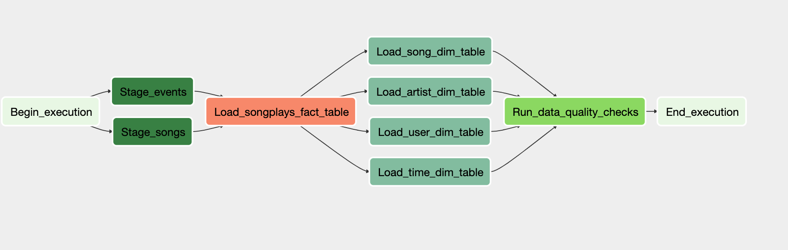

Datasets
For this project, you'll be working with two datasets. Here are the s3 links for each:

Log data: s3://dend/log_data
Song data: s3://dend/song_data
Project template
To get started with the project:

Go to the workspace on the next page, where you'll find the project template. You can work on your project and submit your work through this workspace.

Alternatively, you can download the project template package and put the contents of the package in their respective folders in your local Airflow installation.

The project template package contains three major components for the project:

The dag template has all the imports and task templates in place, but the task dependencies have not been set
The operators folder with operator templates
A helper class for the SQL transformations
With these template files, you should be able see the new DAG in the Airflow UI. The graph view should look like this:

You should be able to execute the DAG successfully, but if you check the logs, you will see only operator not implemented messages.

Configuring Airflow and the DAG
Before adding functionality to the operators and creating a functional data pipeline, you'll need to take some time to change some of the basic configurations on Airflow.

Modify your airflow.cfg file so that following settings are changed:

Change the concurrency settings so that only 8 concurrent DAG runs are allowed
Change executor to LocalExecutor
Do not load the example DAGs
In the DAG, add default parameters according to these guidelines

The DAG does has not dependencies on past runs
On failure, the task are retried 3 times
Retries happen every 5 minutes
Catchup is turned off
Do not email on retry
In addition, configure the task dependencies so that after the dependencies are set, the graph view follows the flow shown in the image below.

Final DAG
Working DAG with correct task dependencies

Building the operators
To complete the project, you need to build four different operators that will stage the data, transform the data, and run checks on data quality.

You can reuse the code from Project 2, but remember to utilize Airflow's built-in functionalities as connections and hooks as much as possible and let Airflow do all the heavy-lifting when it is possible.

All of the operators and task instances will run SQL statements against the Redshift database. However, using parameters wisely will allow you to build flexible, reusable, and configurable operators you can later apply to many kinds of data pipelines with Redshift and with other databases.

Stage Operator
The stage operator is expected to be able to load any JSON and CSV formatted files from S3 to Amazon Redshift. The operator creates and runs a SQL COPY statement based on the parameters provided. The operator's parameters should specify where in S3 the file is loaded and what is the target table.

The parameters should be used to distinguish between JSON and CSV file. Another important requirement of the stage operator is containing a templated field that allows it to load timestamped files from S3 based on the execution time and run backfills.

Fact and Dimension Operators
With dimension and fact operators, you can utilize the provided SQL helper class to run data transformations. Most of the logic is within the SQL transformations and the operator is expected to take as input a SQL statement and target database on which to run the query against. You can also define a target table that will contain the results of the transformation.

Dimension loads are often done with the truncate-insert pattern where the target table is emptied before the load. Thus, you could also have a parameter that allows switching between insert modes when loading dimensions. Fact tables are usually so massive that they should only allow append type functionality.

Data Quality Operator
The final operator to create is the data quality operator, which is used to run checks on the data itself. The operator's main functionality is to receive one or more SQL based test cases along with the results that are expected from these tests, and then execute these tests. For each the test, the test result and expected result needs to be checked. If the results do not match, the operator should raise an exception.

